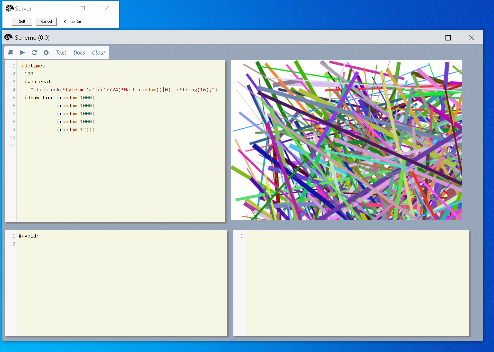

# scheme-web-view
**A web view for scheme** 

Composed from  Node Web Kit and Chez Scheme; on Windows 10.

-------

*Selfie* 

**This requires NWJS and Windows 10.*

**Reason**

I prefer a workspace type interface rather than a terminal interface.

I like panes rather than overlapping windows; you can adjust these panes a little; there is an invisible splitter between them; you can drag that.

**Usage**

- Type in your scheme code; press control-return; the result is displayed below.
- Pressing shift-return will run a selected bit of code; I use that a lot.

If you write a function that uses display; that output goes into the wider transcript pane.

Although the text tiles are editable (thanks to code mirror) this is not an editor; visual studio code is a great modern editor for editing scheme and C++ code.

As well as executing scheme functions in the browser based view; you can also have the scheme functions create and execute any JavaScript in the web view; so that makes for reasonably unlimited potential.

The web view provides a communications channel; so that the browser and scheme can communicate directly.

There is still a web server; to load content; I always find browser controls are happier if you do not force feed them content against their natural flow and inclinations.

The image view; provides a canvas pane for drawing 2d graphics.

**Limitations**

I am using the single threaded version of scheme so it only ever runs one thing at a time. 

Being linked to the browser control; certain function calls are going to be very asynchronous and possibly run in different threads; even so; only one thing will ever run in the scheme engine at a time.

Some features of Chez Scheme are deeply linked into the core of its terminal loving nature; and very hard to use outside of it; I have tried to redirect the traffic; but not intrusively.  I do not modify Chez Scheme at all.

##### Other documentation

There is a Wiki here with notes.

Including a  with pictures. 

And other readme files; as I do write documentation.

#### Building

- I use a modern version of windows 10; and a Visual Studio.
- I use a web server that is a header only library; and some components that can be obtained using vcpkg; a C++ package manager.
- Will add a detailed build guide later.

#### Deploying

This release needs to be dropped onto an nwjs installation; nwjs provides the browser; viewer and some additional features; such as menus.

It might be possible to make scheme into a native node add on; and drop the web server parts; or not.

------

Chez Scheme

https://github.com/cisco/ChezScheme

---

NWJS

https://nwjs.io/

-----

